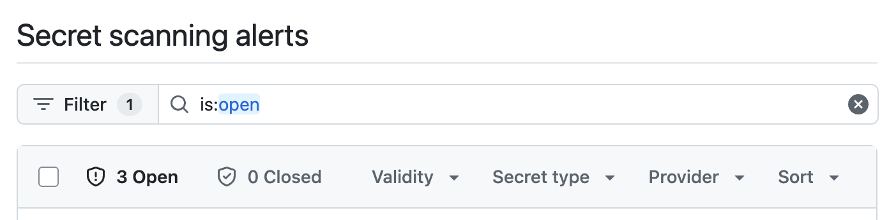
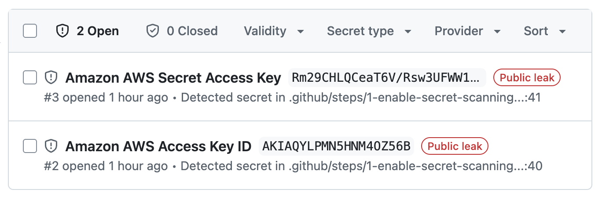
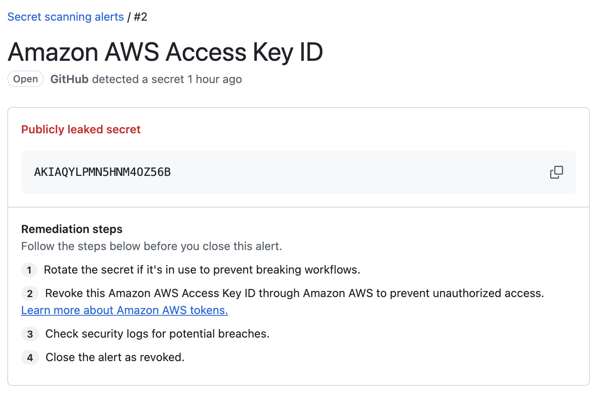
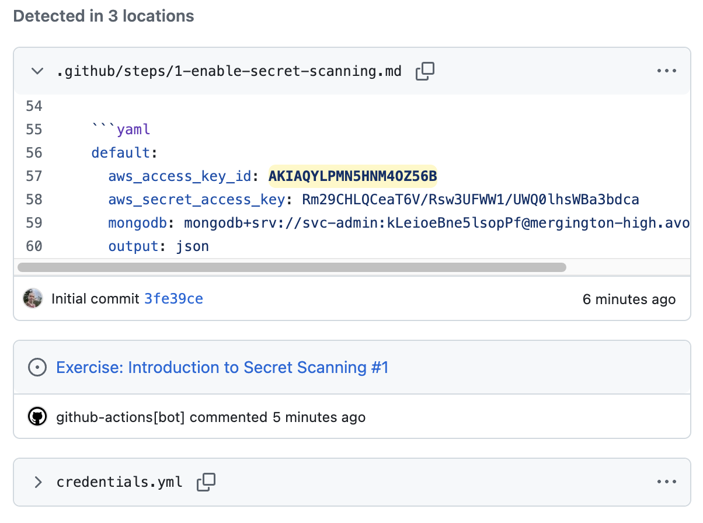
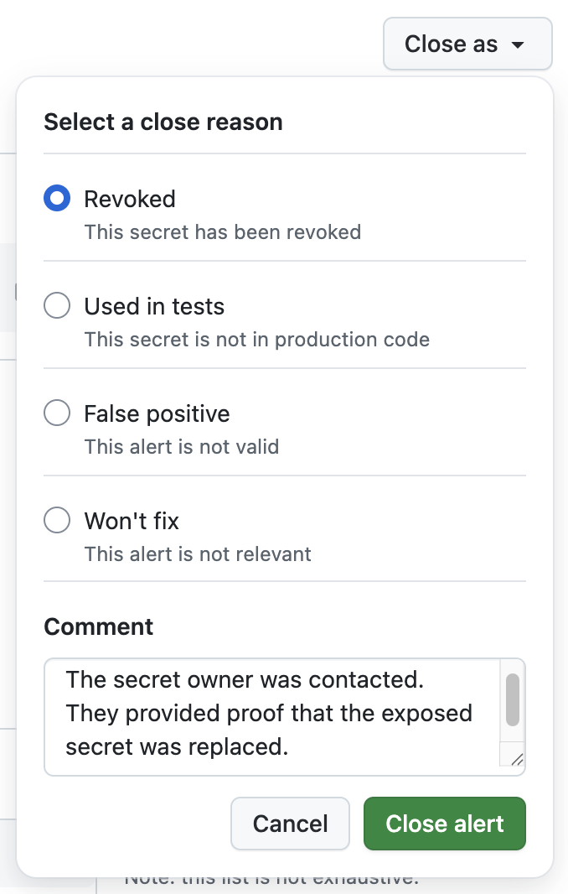
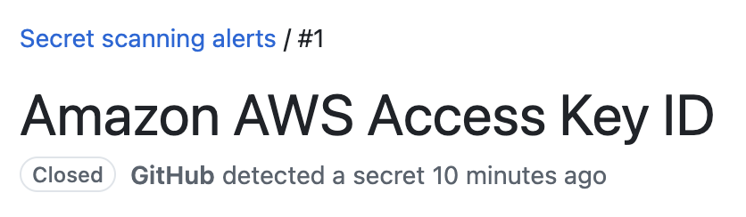
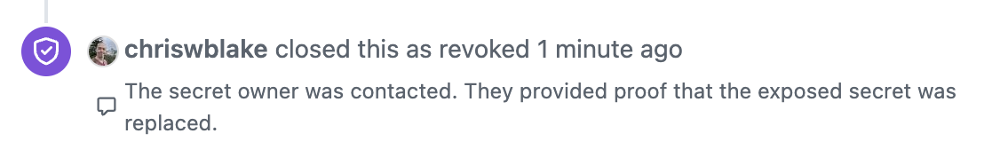

## Passo 2: Revisar e fechar alertas do secret scanning

No passo anterior, você habilitou o secret protection e commitou um arquivo sensível no repositório. Agora vamos revisar nossos alertas abertos de secret scanning e fechar um deles.

### :keyboard: Atividade: Triar alertas do secret scanning

1. No cabeçalho do seu repositório, clique na aba **Security**.

1. Na navegação lateral esquerda, selecione a opção **Secret scanning**.

1. Observe as diversas opções na barra superior que podem ajudar na triagem dos alertas.

   

1. Clique no menu suspenso **Provider** e selecione `Amazon AWS` para filtrar a visualização. Note que agora apenas 2 das 3 entradas são listadas.

   

### :keyboard: Atividade: Revisar um alerta do secret scanning

1. Na lista de alertas abertos, selecione o alerta `Amazon AWS Access Key ID`. Isso abrirá uma página de detalhes com mais informações.

1. No topo da página, é possível visualizar rapidamente o status do alerta, quando ele foi aberto, o segredo exposto e algumas etapas de remediação.

   

1. Role um pouco para baixo até a área **Detected in X locations** e você verá todos os lugares onde esse segredo foi detectado, incluindo o arquivo `credentials.yml` que você criou. Note que o secret protection não cria alertas duplicados para o mesmo segredo encontrado em vários locais, como por exemplo na nossa issue de aprendizado.

   

### :keyboard: Atividade: Fechar um alerta

Quando o secret protection encontra um segredo no seu repositório, a primeira coisa a fazer é **desativar esse segredo junto ao provedor**. Você deve assumir que ele já foi exposto.

> [!TIP]
> Alguns [segredos suportados](https://docs.github.com/en/code-security/secret-scanning/introduction/supported-secret-scanning-patterns#default-patterns) são enviados automaticamente ao provedor quando vazam.

1. Supondo que você já tenha executado as etapas de remediação, podemos atualizar o status do nosso alerta. No canto superior direito, selecione o menu suspenso **Close as**.

   > 🚨 **Atenção:** **NÃO** feche um alerta aberto sem executar as etapas de remediação. Isso apenas esconde o problema e gera uma falsa sensação de segurança. Pode até disparar alertas adicionais no seu departamento de cibersegurança. 🤦

1. Escolha a opção `Revoked` e escreva uma descrição útil das suas etapas de remediação na caixa de comentário (exemplo abaixo). Depois clique em **Close alert**.

   ```txt
   O responsável pelo segredo foi contatado. Ele comprovou que o segredo exposto foi substituído.
   ```

   > 💡 **Dica:** Isso é importante para que o log de auditoria possa fornecer informações críticas caso uma investigação seja necessária no futuro.

   


1. O status do alerta agora exibe `Closed` e a trilha de auditoria inclui a nossa explicação.

   

   

1. Com pelo menos um dos nossos alertas resolvido, vamos adicionar um comentário para informar à Mona que concluímos este passo, para que ela compartilhe o próximo.

   ```txt
   Olá @professortocat, resolvi o alerta de segurança. Qual é o próximo passo?
   ```
