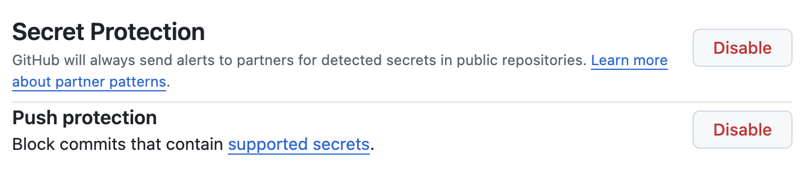
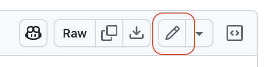
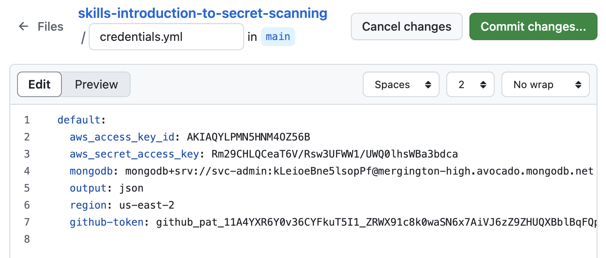
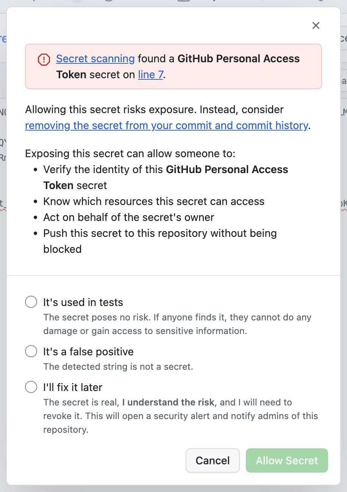
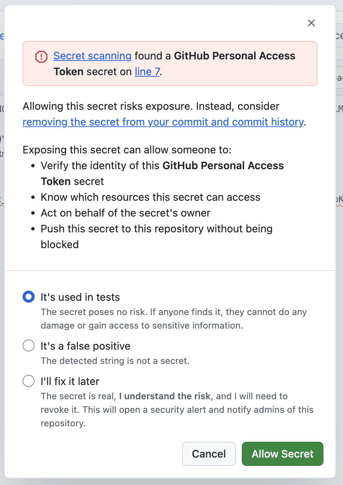

## Passo 3: Habilitar o push protection

Nesta seção, você vai configurar seu repositório para impedir que novos segredos sejam expostos.

### O que é push protection?

Quando alguém tenta enviar alterações de código para o GitHub (um push), o secret scanning verifica se há segredos de alta confiança. O secret scanning lista todos os segredos detectados para que a pessoa autora possa revisá-los e removê-los ou, se necessário, permitir que sejam enviados.

### :keyboard: Atividade: Configurar o push protection

> [!IMPORTANT]
> Desabilitamos o push protection no primeiro passo por questões didáticas. Normalmente ele vem habilitado por padrão em todos os repositórios públicos.

1. No cabeçalho do seu repositório, clique na aba **Settings**.
1. Na navegação lateral esquerda, na seção **Security**, selecione **Advanced Security**.
1. Role a página para baixo, passando pelas seções **Code Scanning** e **Dependabot**, até encontrar a seção **Secret Protection**.
1. Ajuste a configuração padrão conforme abaixo.

   - **Secret Protection:** `enabled`
   - **Push Protection:** `enabled`

   

### :keyboard: Atividade: Tentar enviar um segredo

Agora que o push protection está habilitado, vamos testá-lo!

1. No cabeçalho do seu repositório, clique na aba **Code**.

1. Na lista de arquivos, clique no arquivo `credentials.yml` para visualizá-lo.

1. Acima da pré-visualização do conteúdo, clique no botão **Edit**.

   

1. Copie o segredo inativo abaixo para o arquivo, removendo o texto `<REMOVE_ME>`. O resultado deve ficar parecido com a captura de tela abaixo.

   ```txt
     github-token: github_pat_<REMOVE_ME>11A4YXR6Y0v36CYFkuT5I1_ZRWX91c8k0waSN6x7AiVJ6zZ9ZHUQXBblBqFQpKd23V6CL7MWMPopnmBxzn
   ```

   

1. No canto superior direito, use o botão **Commit changes...** para **tentar** commitar diretamente na branch `main`. Em vez de commitar o arquivo atualizado, apareceu um alerta do push protection. Muito bom! 🥰

   

> [!IMPORTANT]
> O Secret Push Protection só analisa durante o _**push**_ para o GitHub. Ele não consegue verificar seus commits locais. Se você tiver um segredo em um commit local e ele estiver vários commits atrás, será preciso remover o segredo do histórico de commits da sua branch. Veja [resolving a blocked push on the command line](https://docs.github.com/en/code-security/how-tos/secure-your-secrets/work-with-leak-prevention/working-with-push-protection-from-the-command-line).

### :keyboard: Atividade: Contornar o push protection

Em alguns casos, você pode escrever código que se parece com um segredo e ter um commit bloqueado incorretamente — por exemplo, ao escrever testes para um processo de autorização. Nessas situações, você pode optar por contornar o push protection. Vamos praticar isso.

1. Selecione a opção `It's used in tests`. Note que a descrição corresponde ao nosso caso de uso de aprendizado atual.

   

1. Clique em **Allow secret**. Um banner de notificação informa que você já pode tentar commitar novamente.

1. No canto superior direito, use o botão **Commit changes...** para commitar diretamente na branch `main`.

1. Com o arquivo atualizado, a Mona já deve estar verificando seu trabalho. Depois da verificação, ela vai dar o feedback e a revisão final. Bom trabalho! Você concluiu tudo! 🎉
